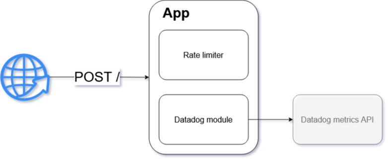

# events-to-datadog-bridge
Simple app to ingest events with http requests and bridge them to Datadog metrics API.

[](https://codecov.io/gh/dkhorev/events-to-datadog-bridge)




## Goals
- target of <1000ms response time with 100 RPS
- events are relayed to datadog as metrics once a minute

## Installation

```bash
$ npm i
```

## Running the app

```bash
# development
$ npm run start

# watch mode
$ npm run start:dev

# production mode
$ npm run start:prod
```

## Test

```bash
# unit and integration tests
$ npm run test

# e2e tests
$ npm run test:e2e

# test coverage
$ npm run test:cov
```

## Docker - build

`DOCKER_BUILDKIT=1 docker build --pull -t events-to-datadog-bridge -f docker/Dockerfile .`

## Deployment

### DigitalOcean Apps

Just point wizard to the repo and provide required ENV credentials.

I.e.:
```bash
DATADOG_SERVICE_NAME=events
DATADOG_URL=app.datadoghq.eu
DATADOG_API_KEY=...
EVENT_NAME=new-order
```

## License

Nest is [MIT licensed](LICENSE).
